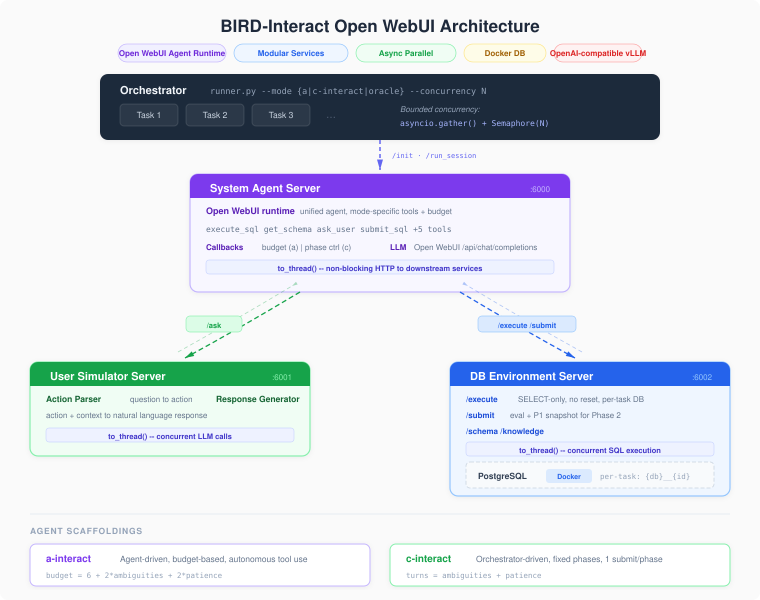

# BIRD-Interact Open WebUI

**Open WebUI-backed implementation of the [BIRD-Interact](https://bird-interact.github.io/) benchmark** — an interactive text-to-SQL evaluation framework with dynamic agent-environment interactions.

This project provides a modular, service-based architecture with parallel experiment execution, supporting both **Conversational Interaction (c-Interact)** and **Agentic Interaction (a-Interact)** modes. LLM calls go through Open WebUI v0.11.0 to an OpenAI-compatible local model.

> For the original BIRD-Interact benchmark, paper, leaderboard, and dataset details, see the [main repository](https://github.com/bird-bench/BIRD-Interact).

## Architecture

```
orchestrator/runner.py          Parallel evaluation runner (--mode, --concurrency)
        |
        ├── system_agent (6000)     Open WebUI agent runtime with BIRD tools
        ├── user_simulator (6001)   Two-stage function-driven user simulator
        └── db_environment (6002)   SQL execution + evaluation + per-task DB isolation
                |
                └── PostgreSQL      BIRD-Interact databases (Docker)

Open WebUI (Docker :3000)
        |
        └── http://192.168.1.233:8000/v1  (OpenAI-compatible vLLM)
```

<p align="center">
  
</p>

**Key features:**

- **Modular microservices** — three independent services communicating via HTTP. Deploy on different machines, swap any component (bring your own agent, user simulator, or DB backend), or scale services independently.
- **Extensible & research-friendly** — each service can be developed, tested, and replaced independently. Easy to plug in a new agent scaffold, experiment with different user simulation strategies, or adapt the evaluation environment for new tasks.
- **Unified local runtime** — both c-interact and a-interact use the same Open WebUI client and resolved agent profiles
- **Parallel execution** — `asyncio.Semaphore` + per-task DB copies for lock-free concurrency
- **OpenAI-compatible LLM** — routes both BIRD LLM services through Open WebUI to a local vLLM model
- **Per-task DB isolation** — each task gets its own database copy; SELECT-only enforcement for execute; Phase 1 snapshots for Phase 2
- **Budget system** — bird-coin tool costs (a-interact) and clarification turn limits (c-interact), both calculated per task from ambiguity count + patience
- **Phase control (c-interact)** — two-phase evaluation (P1 + follow-up P2), with one debug retry per phase

## Quick Start

### 1. Prerequisites

- Python 3.10+
- Docker (for PostgreSQL databases)

### 2. Start Open WebUI and PostgreSQL

If you already have the BIRD-Interact PostgreSQL container running (from the [original setup](https://github.com/bird-bench/BIRD-Interact)), you can reuse it directly — just ensure it's accessible on the configured port.

Otherwise, start the database:

```bash
docker compose up -d open-webui postgresql  # Open WebUI + lite PostgreSQL
docker compose up -d --profile full       # full (26 DBs, 600 tasks)
```

Wait for initialization to complete:

```bash
docker compose logs -f postgresql
# Look for: "database system is ready to accept connections"
```

### 3. Install dependencies

```bash
python -m venv .venv
. .venv/bin/activate
python -m pip install --upgrade pip
python -m pip install -r requirements.txt
```

### 4. Configure

```bash
cp .env.example .env
# Edit .env with your settings:
#   - OPEN_WEBUI_API_KEY (internal Open WebUI Bearer token, if enabled)
#   - SYSTEM_AGENT_MODEL / USER_SIMULATOR_MODEL
#   - OPEN_WEBUI_BASE_URL
#   - DATASET: "lite" or "full"
```

### 5. Start services

```bash
docker compose up -d open-webui postgresql
bash scripts/start_services.sh
```

The Neo4j-backed `kg-v1` profile is opt-in. Configure an embedding credential
and endpoint separately from the chat-model settings, start the Compose `kg`
profile and provision the graph from the selected dataset:

```bash
docker compose --profile kg up -d neo4j
EMBEDDING_API_BASE_URL=https://api.openai.com/v1 \
EMBEDDING_API_KEY=... KG_ENABLED=1 bash scripts/start_services.sh
DATASET=lite bash scripts/provision_kg.sh
```

`DATASET=full` selects `bird-interact-full`. Provisioning is rerunnable and
does not reset Neo4j unless `RESET_KG=1` is explicitly supplied.

The opt-in `metadata-5-2-kg` profile uses the fixed local metadata corpus in
the workspace-level `../metadata/` directory, separate from the dataset
directories. Build it once after PostgreSQL is available, then build its local
embedding cache while the embedding service is running:

```bash
python scripts/generate_metadata_5_2.py
python scripts/build_metadata_embeddings_5_2.py
```

Both commands fail closed: corpus generation requires read-only PostgreSQL
range queries for every lite column, and evaluation never rebuilds a missing
JSON or vector cache. The JSON files and manifest under `../metadata/` are
source artifacts; the NumPy vectors under `.cache/metadata-5-2-kg/` are local
cache files.

The opt-in `metadata-5-2` profile reuses those same metadata assets but exposes
metadata candidates only. It is available for both interaction modes and does
not provide the Knowledge search tools or change either mode's default profile:

```bash
python -m orchestrator.runner --mode a-interact --agent-profile metadata-5-2
python -m orchestrator.runner --mode c-interact --agent-profile metadata-5-2
```

Create the first Open WebUI account through `http://127.0.0.1:3000`, then create an Open WebUI API key from the account settings and put it in `.env` as `OPEN_WEBUI_API_KEY`. The key authenticates the BIRD services; the upstream vLLM server does not require a provider API key.

Verify the complete model path:

```bash
set -a; source .env; set +a
bash scripts/check_openwebui.sh
```

### 6. Run evaluation

```bash
# a-interact (agent mode) — 300 tasks, concurrency 3
python -m orchestrator.runner --mode a-interact --concurrency 3

# c-interact (conversational mode) — 300 tasks, concurrency 5
python -m orchestrator.runner --mode c-interact --concurrency 5

# Oracle test (ground-truth SQL, validates pipeline)
python -m orchestrator.runner --mode oracle --concurrency 5

# Specific tasks
python -m orchestrator.runner --mode a-interact --limit 10

# Select a profile or an alternate profile configuration
python -m orchestrator.runner --mode a-interact --agent-profile a-interact-schema
python -m orchestrator.runner --mode a-interact --agent-profile kg-v1
python -m orchestrator.runner --mode c-interact --agent-profile kg-v1
python -m orchestrator.runner --mode a-interact --agent-profile metadata-5-2-kg
python -m orchestrator.runner --mode c-interact --agent-profile metadata-5-2-kg
python -m orchestrator.runner --mode a-interact --agent-profile metadata-5-2
python -m orchestrator.runner --mode c-interact --agent-profile metadata-5-2
python -m orchestrator.runner --mode c-interact --agent-profiles-file /path/to/agent_profiles.json

# Full dataset
DATASET=full python -m orchestrator.runner --mode a-interact --concurrency 3
```

### 7. View results

```bash
# Generate HTML report
python -m orchestrator.report results/eval_a_interact.json

# Run test harness (validates endpoints without LLM calls)
python -m orchestrator.test_harness --concurrency 5
```

## LLM Configuration

Both BIRD LLM services call the Open WebUI backend. Open WebUI is configured as an OpenAI-compatible upstream for the remote vLLM server:

```env
OPEN_WEBUI_BASE_URL=http://127.0.0.1:3000
OPEN_WEBUI_API_KEY=
OPENAI_API_BASE_URLS=http://192.168.1.233:8000/v1
OPENAI_API_KEYS=
SYSTEM_AGENT_MODEL=google/gemma-4-31B-it
USER_SIMULATOR_MODEL=google/gemma-4-31B-it

# Optional kg-v1 embedding upstream; intentionally independent from chat.
EMBEDDING_API_BASE_URL=https://api.openai.com/v1
EMBEDDING_API_KEY=
EMBEDDING_MODEL=text-embedding-3-small
EMBEDDING_DIMENSIONS=1536
NEO4J_URI=bolt://127.0.0.1:7687
NEO4J_USER=neo4j
NEO4J_PASSWORD=bird-interact-dev
NEO4J_DATABASE=neo4j
```

## Agent profiles

Profiles are defined in [`config/agent_profiles.json`](config/agent_profiles.json). Each profile has an ordered `tools` list and a required `prompt_file`; profiles do not contain model, temperature, token, mode, or version settings.

Prompt files are UTF-8 Markdown files relative to the configuration file. They may use `{{db_name}}`, `{{db_schema}}`, `{{external_kg}}`, `{{max_turn}}`, and the optional `{{available_tools}}` placeholder. The tool manifest uses the original prompt wording and ordering. A profile is resolved once when an evaluation starts, then its complete prompt snapshot is sent to each task session. Session state and evaluation output retain only the profile `name` and `tools`, never the prompt text.

The system-agent API accepts the same snapshot at the top level of `/init_session`:

```json
{
  "task_id": "task-1",
  "mode": "a-interact",
  "agent_profile": {
    "name": "a-interact-default",
    "tools": ["ask_user", "get_schema"],
    "prompt_template": "..."
  },
  "state": {}
}
```

If `agent_profile` is omitted, the service resolves the mode's `defaults` entry. A custom snapshot must include `name`, `tools`, and `prompt_template`. Use `reset: true` to replace the profile of an existing session; `reset: false` keeps the current session profile.

## Dataset


| Version  | Tasks | Databases | PostgreSQL Image                                | HuggingFace                                                                      |
| -------- | ----- | --------- | ----------------------------------------------- | -------------------------------------------------------------------------------- |
| **Lite** | 300   | 18        | `shawnxxh/bird-interact-postgresql:latest`      | [bird-interact-lite](https://huggingface.co/datasets/birdsql/bird-interact-lite) |
| **Full** | 600   | 26        | `shawnxxh/bird-interact-postgresql-full:latest` | [bird-interact-full](https://huggingface.co/datasets/birdsql/bird-interact-full) |


### Download & Setup

1. Download the dataset from HuggingFace and place it in the repo root:
  ```bash
   # Lite
   git clone https://huggingface.co/datasets/birdsql/bird-interact-lite bird-interact-lite
   # Full
   git clone https://huggingface.co/datasets/birdsql/bird-interact-full bird-interact-full
  ```
2. **Ground Truth & Test Cases**: The public dataset does not include `sol_sql` and `test_cases` fields. To obtain them, email [bird.bench25@gmail.com](mailto:bird.bench25@gmail.com) with the tag `[bird-interact-lite GT&Test Cases]` or `[bird-interact-full GT&Test Cases]` in the subject. You will receive the GT file automatically.
3. Combine public data with GT:
  ```bash
   python scripts/combine_public_with_gt.py \
     bird-interact-lite/bird_interact_data.jsonl \
     /path/to/bird_interact_gt_kg_testcases.jsonl \
     bird-interact-lite/bird_interact_data.jsonl
  ```

Each dataset directory contains:

- `bird_interact_data.jsonl` — task definitions
- `{db_name}/` — per-database schema, column meanings, external knowledge

Set `DATASET=lite` or `DATASET=full` in `.env`.

## Project Structure

```
.
├── system_agent/           # Open WebUI agent service (port 6000)
│   ├── agent.py            # Profile prompt rendering and tool manifests
│   ├── server.py           # FastAPI endpoints
│   ├── openwebui_runtime.py  # Session, tool loop, budget, phase management
│   └── tools.py            # OpenAI-compatible BIRD tool schemas
├── db_environment/         # DB service (port 6002)
│   ├── server.py           # SQL execution, evaluation, per-task DB
│   └── knowledge_graph.py  # Optional Neo4j kg-v1 repositories
├── embedding/              # Optional OpenAI text-embedding gateway (6003)
├── user_simulator/         # User sim service (port 6001)
│   ├── server.py           # Two-stage simulator (action parser + response generator)
│   ├── prompts.py          # Prompt templates
│   └── sql_parser.py       # SQL segmentation
├── shared/                 # Shared utilities
│   ├── agent_profiles.py   # Profile schema, validation, and resolution
│   ├── config.py           # Centralized settings
│   ├── llm.py              # Open WebUI backend client
│   ├── db_utils.py         # PostgreSQL pooling & evaluation
│   └── models.py           # Pydantic models
├── orchestrator/           # Evaluation runners
│   ├── runner.py           # Parallel runner (--mode, --concurrency, --oracle)
│   ├── cinteract.py        # c-interact pipeline
│   ├── ainteract.py        # a-interact pipeline
│   ├── report.py           # HTML report generator
│   └── test_harness.py     # Endpoint validation (no LLM)
├── config/
│   ├── agent_profiles.json  # Profile defaults and tool selections
│   └── prompts/              # UTF-8 system prompt templates
├── bird-interact-lite/     # Lite dataset (300 tasks)
├── bird-interact-full/     # Full dataset (600 tasks)
├── docker-compose.yml      # PostgreSQL + opt-in Neo4j containers
├── scripts/                # Service startup and graph provisioning scripts
├── .env.example            # Configuration template
└── requirements.txt
```

## Evaluation Modes

### a-interact (Agentic Interaction)

The agent autonomously decides which tools to use within a budget. The selected profile controls the ordered schemas exposed to the model; the default a-interact profile includes `execute_sql`, `get_schema`, `get_column_meaning`, `get_knowledge_definition`, `ask_user`, `submit_sql`, etc.

Budget formula: `6 + 2 * num_ambiguities + 2 * patience`

### c-interact (Conversational Interaction)

Fixed workflow driven by the orchestrator:

1. **Phase 1**: Clarify (ask_user × N) → Submit SQL (once) → Debug if wrong (once)
2. **Phase 2**: Follow-up question → Submit SQL (once) → Debug if wrong (once)

## Results

Evaluated on BIRD-Interact-Lite (300 tasks), Claude Sonnet 4.5, patience=3, v1 user simulator prompt (claude-haiku-4-5):


| Mode                       | P1 (%) | P2 (%) | Avg Reward |
| -------------------------- | ------ | ------ | ---------- |
| **c-interact (legacy baseline)** | 44.67  | 30.67  | 0.395      |
| **c-interact (reference)** | 40.47  | 27.09  | —          |
| **a-interact (legacy baseline)** | 36.67  | 23.67  | 0.328      |
| **a-interact (reference)** | 37.67  | 22.00  | —          |


## License

MIT License. See [LICENSE](LICENSE).

## Citation

```bibtex
@inproceedings{
huo2026birdinteract,
title={{BIRD}-{INTERACT}: Re-imagining Text-to-{SQL} Evaluation via Lens of Dynamic Interactions},
author={Nan Huo and Xiaohan Xu and Jinyang Li and Per Jacobsson and Shipei Lin and Bowen Qin and Binyuan Hui and Xiaolong Li and Ge Qu and Shuzheng Si and Linheng Han and Edward Alexander and Xintong Zhu and Rui Qin and Ruihan Yu and Yiyao Jin and Feige Zhou and Weihao Zhong and Yun Chen and Hongyu Liu and Chenhao Ma and Fatma Ozcan and Yannis Papakonstantinou and Reynold Cheng},
booktitle={The Fourteenth International Conference on Learning Representations},
year={2026},
url={https://openreview.net/forum?id=nHrYBGujps}
}
```

## Acknowledgement

BIRD Team & Google Cloud. Runtime integration uses Open WebUI's OpenAI-compatible backend API.
